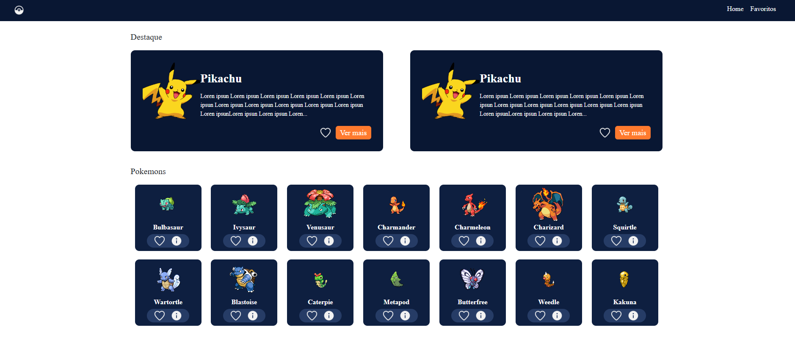
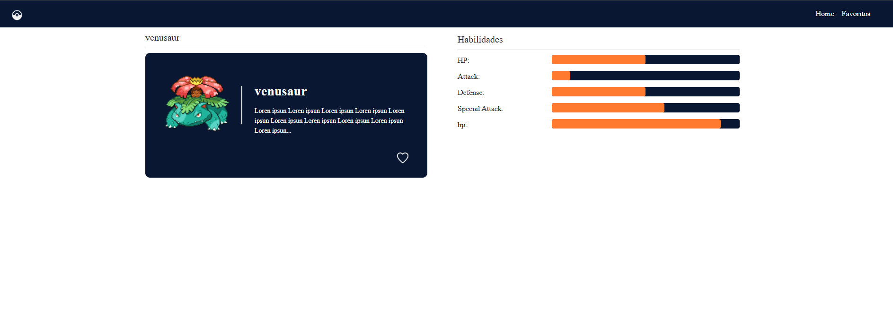

# 🎮 Pokédex App

A modern, responsive Pokédex web application built with React — browse, search, and explore Pokémon data powered by the PokéAPI.

[](https://react.dev)
[](https://redux-toolkit.js.org)
[](https://firebase.google.com)
[](https://sass-lang.com)
[](LICENSE)

---

## 📸 Screenshots

<!-- Add your screenshots inside the docs/screenshots/ folder and update the paths below -->

| Home | Detail |
|------|--------|
|  |  |

---

## ✨ Features

- 🔍 **Browse & Search** — Explore all Pokémon with infinite scroll
- 📖 **Detail Page** — View stats, types, abilities, and evolutions
- ❤️ **Favorites** — Save your favorite Pokémon (persisted with Redux Persist)
- 🔐 **Authentication** — Login & register powered by Firebase Auth
- 🎨 **Smooth Animations** — Page transitions with AOS
- 📱 **Responsive Design** — Looks great on mobile and desktop

---

## 🛠️ Tech Stack

| Technology | Purpose |
|------------|---------|
| **React 18** | UI framework |
| **Redux Toolkit** | Global state management |
| **Redux Persist** | Persist favorites across sessions |
| **React Router v6** | Client-side routing |
| **Firebase 9** | Authentication & backend |
| **Axios** | HTTP requests to PokéAPI |
| **SCSS / Sass** | Styling |
| **AOS** | Scroll animations |
| **React Infinite Scroll** | Infinite scroll for Pokémon list |

---

## 🚀 Getting Started

### Prerequisites

- Node.js 16+
- npm or yarn
- A Firebase project (for authentication)

### Installation

```bash
# 1. Clone the repo
git clone https://github.com/hanjarraes/pokemon.git
cd pokemon

# 2. Install dependencies
npm install

# 3. Set up environment variables
cp .env.sample .env
```

### Environment Variables

Edit your `.env` file with the correct values:

```env
PORT=3000
NODE_ENV=development
REACT_APP_WEB_URL=https://pokeapi.co/api/v2

# Firebase config (get these from your Firebase Console)
REACT_APP_FIREBASE_API_KEY=your_api_key
REACT_APP_FIREBASE_AUTH_DOMAIN=your_project.firebaseapp.com
REACT_APP_FIREBASE_PROJECT_ID=your_project_id
REACT_APP_FIREBASE_STORAGE_BUCKET=your_project.appspot.com
REACT_APP_FIREBASE_MESSAGING_SENDER_ID=your_sender_id
REACT_APP_FIREBASE_APP_ID=your_app_id
```

### Running the App

```bash
npm start
```

Open [http://localhost:3000](http://localhost:3000) in your browser.

---

## 📁 Project Structure

```
src/
├── components/        # Reusable UI components
├── pages/             # Route-level page components
├── store/             # Redux store, slices, and reducers
├── hooks/             # Custom React hooks
├── services/          # Axios API calls (PokéAPI)
├── firebase/          # Firebase config & auth helpers
├── styles/            # Global SCSS styles and variables
└── App.js             # App root with router setup
```

---

## 🌐 Live Demo

👉 **[hanjarraes.github.io/pokemon](https://hanjarraes.github.io/pokemon)**

---

## 🔧 Available Scripts

| Command | Description |
|---------|-------------|
| `npm start` | Run development server on port 3000 |
| `npm run build` | Build for production |
| `npm test` | Run tests |
| `npm run eject` | Eject CRA config (irreversible) |

---

## 🤝 Contributing

Contributions are welcome! Feel free to open an issue or submit a pull request.

1. Fork the repository
2. Create a branch: `git checkout -b feature/your-feature`
3. Commit your changes: `git commit -m "feat: add your feature"`
4. Push and open a Pull Request

---

## 📜 License

MIT License — free to use and modify.

---

Made with ❤️ using [PokéAPI](https://pokeapi.co)
